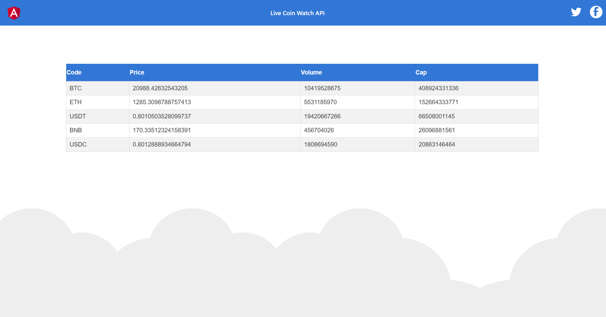
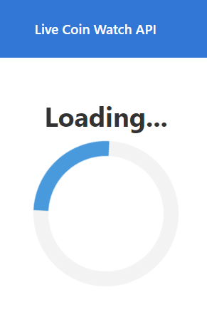

# Nest_Angular_cryptocurrency_API
Displaying Crypto Currency prices from external API on a 2 second interval server poll.
# Prerequisites
1. Node.js >= version 18.12.1
2. Nest.js >= version 10.1.16 `npm install --global @nestjs/cli`
3. Angular >= version 16.2.0 `npm install --global @angular/cli`
# Client
1. cd client
2. npm install
3. run `ng serve` for a dev server. Navigate to `http://localhost:4200`. The app will automatically reload if you change any of the source files.
# Server
1. cd server
2. create `.env file` in the root of the directory and include `API_KEY=<your key>` You can generate an API key [here](https://livecoinwatch.com/tools/api)
3. npm install
4. run `nest start` or `nest start --watch`
# Displayed Results

# Loading Indicator

